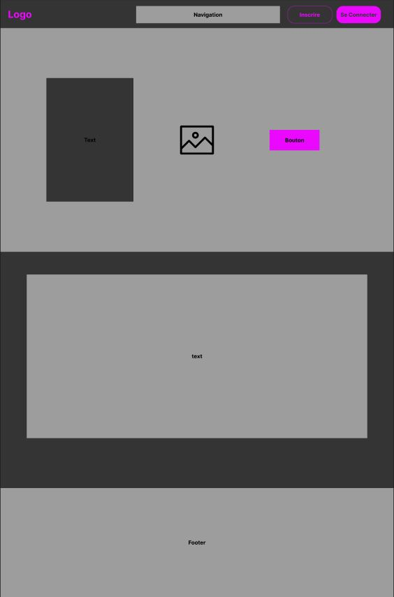
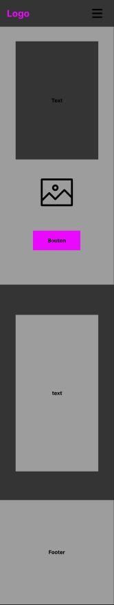

# **Cahier des charges**

### *Site Web fxGuard*

| Nom du projet :   | fxGuard                  |
| ----------------- | ------------------------ |
| Nom de l'auteur : | Edern FERLICOT           |
| Email :           | edern.ferlicot@gmail.com |

### Sommaire

1. **Présentation générale du projet**
   1. *Contexte*
   2. *Objectif(s) qualitatif(s) et/ou quantitatif(s) du site*
   3. *Cible(s) du site / de l'application*
2. **Aspects fonctionnels**
   1. *Description fonctionnelle*
   2. *Arborescence du site / navigation*
   3. *Layout ou wireframe des pages*
   4. *Restriction d'accès*
3. **Ressources**
4. **Ergonomie et graphisme**
   1. *Ergonomie, design & charte graphique*
   2. *Ergonomie*
5. **Contraintes techniques**
6. **Planning & suivi du projet**

## **1. Présentation générale du projet**

### 1.1 **Contexte**

Le projet « fxGuard » a pour but de permettre la modération/administration et la modification du contenu présent dans le jeu d’un serveur FiveM, le tout dans un espace no-code.  
Les serveurs FiveM sont des serveurs de jeux basés sur GTA5 permettant l’ajout de fonctionnalité et de contenu, comme l’ajout de voiture, chat de proximité, etc.

### 1.2 **Objectif(s) qualitatif(s) et/ou quantitatif(s) du site**

- Créer une interface graphique permettant aux administrateurs d’interagir avec le contenu présent en jeu.

### 1.3 **Cible(s) du site / de l'application**

Le site Web a pour vocation à être utilisé par une tranche de public assez vaste :
- Des adolescents, jeunes adultes, adultes, avec un niveau débutant à confirmé en administration de serveur FiveM.
- Dans un premier temps, mon projet a pour objectif d’être utilisé dans les pays francophones.
- Le support le plus utilisé sera, à mon sens, dans un premier temps le desktop, mais je vais développer aussi une version mobile pour rester compétitif face aux solutions déjà existantes.

## **2. Aspects fonctionnels**

### 2.1 **Description fonctionnelle**

Lorsque l’utilisateur n’est pas authentifié, une page de promotion de l'interface avec toutes les fonctionnalités proposées sera affichée. Une partie proposera de s’inscrire ou de se connecter.

Si l’utilisateur souhaite s’inscrire, il devra renseigner un formulaire pour récupérer ses informations et avoir un espace dédié.

Une fois connecté, il aura accès à une liste de serveurs qui utilisent mon interface web et auxquels il a accès. Il devra alors choisir sur quel serveur il souhaite administrer. Une fois son choix fait, il aura accès à un menu avec différentes fonctionnalités.

En tant qu’administrateur authentifié, nous avons accès à la liste de tous les serveurs utilisant notre solution, ainsi que tous les comptes créés. Une fois un serveur sélectionné, nous avons accès au même menu que les utilisateurs authentifiés, avec la différence que nous pouvons effectuer des modifications non modifiables par l’utilisateur et des champs auxquels l’utilisateur peut seulement accéder en lecture.

### 2.2 **Arborescence du site / navigation**

*En cours...*

### 2.3 **Layout ou wireframe des pages**

*Structure de la page Desktop :*

*Structure de la page Mobile :*

### 2.4 **Restriction d'accès**

| Pages             | Non-Authentifié | Authentifié | Administrateur |
| ----------------- | --------------- | ----------- | -------------- |
| Accueil           | X               | X           | X              |
| Connexion         | X               | X           | X              |
| Inscription       | X               | X           | X              |
| Contact           | X               | X           | X              |
| Serveur Liste     |                 | X           | X              |
| Serveur Paramètre |                 | X           | X              |
| Profil            |                 | X           | X              |
| Utilisateur List  |                 |             | X              |

## **3. Ressources**

- API : https://gta.vercel.app/api/vehicles/all

## **4. Ergonomie et graphisme**

### 4.1 **Ergonomie, design & charte graphique**

Le site aura un thème très épuré et moderne, avec un fond gris foncé/noir et une couleur d’accentuation bleue.  
Le logo sera très simpliste, reprenant le nom du site.  
La police utilisée sera une police neutre, la **Roboto**.

### 4.2 **Ergonomie**

Le site sera conçu pour être le plus intuitif possible, avec des noms de menus parlants. Les informations les plus importantes seront mises en avant.

## **5. Contraintes techniques**

- **Architecture globale** : appel à des API extérieures, etc.
- **Frontend** :
  - Langages : HTML, CSS, JavaScript
  - Bibliothèques et API
  - Outils : SASS
- **Backend** :
  - Architecture : Model View Controller
  - Langage : PHP, SQL
  - Base de données : MySQL

## **6. Planning & suivi du projet**

*En cours...*
