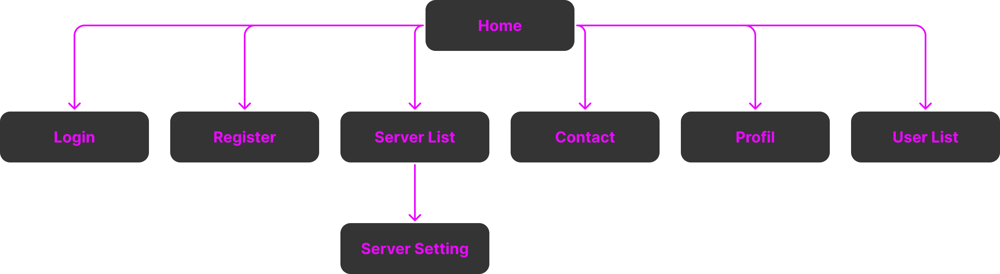
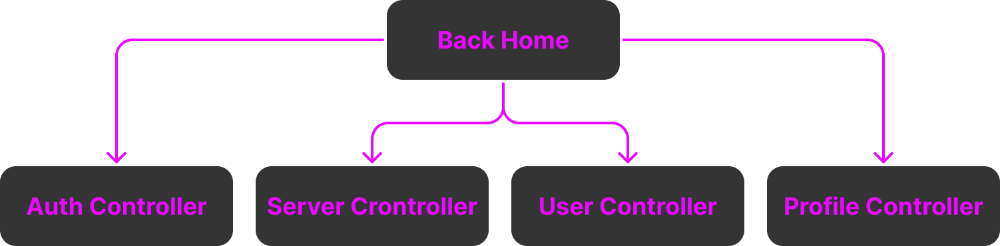
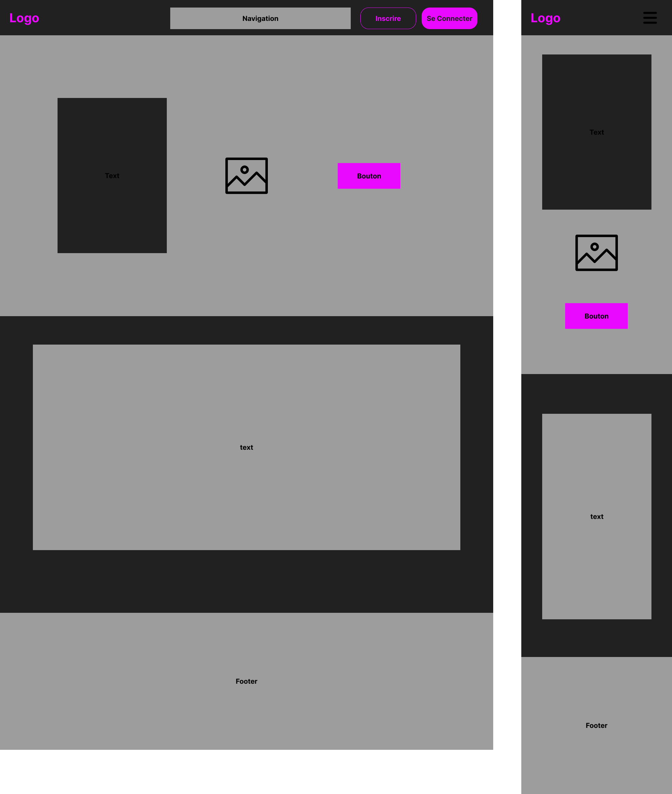

# **Cahier des charges**

### *Site Web fxGuard*

| Nom du projet :   | fxGuard                  |
| ----------------- | ------------------------ |
| Nom de l'auteur : | Edern FERLICOT           |
| Email :           | edern.ferlicot@gmail.com |

### Sommaire

1. **Présentation générale du projet**
   1. *Contexte*
   2. *Objectifs qualitatifs*
   3. *Cible(s) du site*
2. **Aspects fonctionnels**
   1. *User story*
   2. *Description fonctionnelle*
   3. *Arborescence du site / navigation*
   4. *Restriction d'accès*
   5. *Layout ou wireframe des pages*
3. **Ressources**
4. **Ergonomie et graphisme**
   1. *Ergonomie, design & charte graphique*
   2. *Ergonomie*
5. **Contraintes techniques**
   1. *Architecture globale*
   2. *Sécurité*
   3. *Eco-responsabilité*
   4. *Accessibilité*
6. **SEO & Référencement**
7. **RGPD/Conditions d'utilisation**
8. **Planning & suivi du projet**
   1. *Groupe de travail*
   2. *Planning*

## **1. Présentation générale du projet**

### 1.1 **Contexte**

<!-- À la demande d'un client, j'ai dû trouver une solution web pour répondre à son besoin de modifier du contenu dans du code mais dans un espace no-code. Plus précisément, il voulait pouvoir modifier un menu accessible en jeu par les joueurs. -->

Le projet « fxGuard » a vu jour à la demande d'un client, qui souhaitait pouvoir modifier des configurations telle que des menus présents en jeu, qui ont un impact direct dans le jeu. En effet, la modification de contenu apparaissant directement dans le jeu peut s'avérer complexe pour une personne qui ne s'y connaît pas.

Ce projet a donc pour but de permettre la modification de configuration telle que des menus présents en jeu d’un serveur FiveM, le tout dans un espace no-code.
Les serveurs FiveM sont des serveurs de jeux basés sur GTA5 permettant l’ajout de fonctionnalités et de contenu, comme l’ajout de voitures, chat de proximité, etc.

### 1.2 **Objectifs qualitatifs**

- Créer une interface lisible et facile à comprendre.
- Avoir un site responsive pour s'adapter à tout type de support

### 1.3 **Cible(s) du site / de l'application**

Le site Web a pour vocation à être utilisé par une tranche de public assez vaste :
- Des adolescents, jeunes adultes, adultes, avec un niveau débutant à confirmé en administration de serveur FiveM.
- Dans un premier temps, mon projet a pour objectif d’être utilisé dans les pays francophones.
- Le support le plus utilisé sera, à mon sens, dans un premier temps le desktop, une version mobile complète sera développée qui servira d'atout pour rester compétitif face aux solutions déjà existantes.

## **2. Aspects fonctionnels**

### 2.1 **User story**

#### En tant qu'utilisateur non authentifié,

- Une page de promotion de l'interface mettant en avant toutes les fonctionnalités disponibles est affichée.

- Il est possible de s'inscrire ou de se connecter à l'interface via une section dédiée.

#### En tant qu'utilisateur authentifié,

- Possibilité de voir toutes les configurations associées au compte.

- Possibilité d'importer les configuration des joueurs.

- Possibilité de créer de nouvelle configuration.

- Possibilité de modifier les configurations.

- Possibilité de supprimer les configurations.

- Possibilité de partager sa configuration.

- Possibilité de donner une note et poster un commentaire sur une confirmation partagée.

- Il est possible de se déconnecter.

#### En tant qu'administrateur de la solution,

- Voir la liste de tous les comptes créés sur le site.

- Accéder à des données statistiques liées au site web.

- Faire la modération des commentaires.

- Promouvoir un utilisateur en administrateur.

### 2.2 **Description fonctionnelle**

1. Inscription
   - Un formulaire d'inscription demandant : pseudo, e-mail et mot de passe.

2. Connexion
   - Formulaire de connexion demandant l'identifiant et le mot de passe.

3. Déconnexion
   - Bouton de déconnexion

4. Gestion du profil utilisateur
   - Les utilisateurs pourront modifier les données renseignées lors de l'inscription.

5. Présentation des fonctionnalités
   - Dans la page d'accueil, un paragraphe de présentation donnant les avantages à utiliser notre solution.

6. Contact
   - Un formulaire de contact sera mis à disposition pour tous les utilisateurs.

7. Création d'une configuration
   - Il est possible de créer une/plusieurs configuration.

8. Fonction de recherche
   - Lors de la création/impotation d'une configuration, il est possible d'effectuer des recherches et y ajouter des filtres.

9. Modifications d'une configuration
    - Si une configuration est déjà existante, il est toujours possible de la modifier même après sa création.

10. Supprimer une configuration
    - Il est possible de supprimer ces propres configurations.

11. Partager sa configuration
    - Possibilité de partagé ou non ces configurations.

12. Ajouter ces des commentaires/notes à des configurations
    - Quand un autre utilisateur publit une configuration il es possible de partager des commentaires et ajouter des notes.

13. Ajouter des catégories à ces configurations
    - Lors de la création de configuration, un champ catégorie doit être rempli pour une meilleure expérience utilisateur lors de la recherche de configuration.
  
14. Promouvoir un utilisateur
    - Je peux promouvoir un utilisateur au rang d'administrateur.

### 2.3 **Arborescence du site / navigation**

   *Front office* :

  

   *Back office* :

  

### 2.4 **Restriction d'accès**

| Pages          | Non-Authentifié | Authentifié | Administrateur |
| -------------- | --------------- | ----------- | -------------- |
| Home           | X               | X           | X              |
| Login          | X               | X           | X              |
| Register       | X               | X           | X              |
| Contact        | X               | X           | X              |
| Config List    |                 | X           | X              |
| Config Creator |                 | X           | X              |
| Config Share   |                 | X           | X              |
| Profile        |                 | X           | X              |
| **Back Home**  |                 |             | X              |
| Statistic      |                 |             | X              |
| User List      |                 |             | X              |
| Comments       |                 |             | X              |

### 2.5 **Layout ou wireframe des pages**

*Structure de la page d'Accueil :*                                           

## **3. Ressources**

- API REST : https://gta.vercel.app/
- Les images présentes sur ce site proviennent de diverses sources, comme Google Images ou Pixabay, et sont toutes libres de droits.

## **4. Ergonomie et graphisme**

### 4.1 **Ergonomie, design & charte graphique**

Le site aura un thème très épuré et moderne, avec un fond gris foncé/noir et une couleur d’accentuation violette.

Palette : 

Le logo sera très simpliste, reprenant le nom du site.  
La police utilisée sera une police neutre, la **Roboto**.

### 4.2 **Ergonomie**

Le site sera conçu pour être le plus intuitif possible, avec des noms de menus parlants. Les informations les plus importantes seront mises en avant.

## **5. Contraintes techniques**

### 5.1 **Architecture globale**

- **Frontend** :
  - Langages : HTML, CSS, JavaScript
  - Préprocesseur CSS : SASS
  - API REST
- **Backend** :
  - Architecture : Model View Controller
  - Langage : PHP, SQL
  - Base de données : MySQL

### 5.2 **Sécurité**

Pour garantir un niveau de sécurité optimal sur la plateforme, les lignes directrices suivantes seront appliquées tant au niveau du front-end que du back-end :

  
- **Protection contre les attaques par injection SQL** : Pour sécuriser l'application, des requêtes préparées et paramétrées seront utilisées afin de séparer les données utilisateurs du code SQL. Cela empêche toute manipulation malveillante des requêtes. Les entrées utilisateurs seront systématiquement échappées pour éviter l'exécution de code SQL non prévu.
  
- **Protection contre les attaques XSS** : Des fonctions sécuritaires, telles que `htmlspecialchars()`, seront appliquées afin de convertir les caractères spéciaux en entités HTML et ainsi éviter les attaques de type Cross-Site Scripting (XSS) en désinfectant les entrées de l’utilisateur.

- **Validation stricte des entrées utilisateurs** : Toutes les entrées utilisateurs seront également soumises à une validation stricte (types, formats, etc.) pour s'assurer qu'elles respectent les critères attendus avant d’être traitées ou stockées.

- **Chiffrement des données sensibles** : Le chiffrement des données sensibles, notamment des mots de passe, sera réalisé à l’aide de fonctions de hachage sécurisées pour garantir leur sécurité en cas de fuite de données.

### 5.3 **Eco-resposabilité**

Afin de réduire l'empreinte écologique du projet fxGuard, plusieurs mesures seront mises en place :

- **Optimisation des performances** : Réduction des requêtes serveur et optimisation du code pour limiter la consommation énergétique.
- **Hébergement vert : Utilisation** d’un hébergement écoresponsable, fonctionnant avec des énergies renouvelables.
- **Compression des ressources** : Minimisation et compression des fichiers CSS, JavaScript et images pour réduire la bande passante utilisée.
  
Ces actions visent à améliorer l’impact environnemental du projet tout en garantissant une expérience utilisateur fluide et performante.

### **5.4 Accessibilité**
L'accessibilité est une priorité afin de garantir une expérience utilisateur optimale pour tous, y compris les personnes en situation de handicap. Pour cela, les actions suivantes seront mises en place :

- **Respect des normes WCAG** : Le site respectera les directives du W3C en matière d'accessibilité numérique (WCAG 2.1, niveau AA minimum).
- **Navigation au clavier** : Toutes les fonctionnalités seront accessibles sans souris, en utilisant uniquement le clavier (tabulation, raccourcis).
- **Contraste et lisibilité** : Les couleurs et typographies seront choisies pour assurer un bon contraste et une lecture aisée, même pour les personnes malvoyantes.
- **Textes alternatifs pour les images** : Toutes les images informatives incluront des descriptions textuelles (attributs alt) pour garantir leur compréhension par les utilisateurs malvoyants.
- **Adaptabilité aux différentes tailles d’écran** : L'interface sera entièrement responsive et optimisée pour différents types d’écrans, y compris mobiles et tablettes (Mobile First).

Ces actions assureront une meilleure accessibilité et permettront au plus grand nombre d’utiliser l’interface sans obstacles.

## **6. SEO & Référencement**

Dans le cadre de la création du site web d'administration de serveur FiveM, un point crucial concerne l'optimisation pour les moteurs de recherche (SEO/référencement).

Bien que le site soit principalement destiné à un usage privé et administratif, il est important de veiller à ce que certaines pages, comme les pages d'informations publiques, de documentation ou de support, soient optimisées pour le SEO.

Cela inclut l'utilisation de balises HTML appropriées, de titres et de descriptions bien structurés, ainsi qu'un contenu pertinent pour améliorer la visibilité sur les moteurs de recherche.

De plus, une architecture claire du site contribuera à la bonne indexation par les moteurs de recherche tout en assurant une navigation fluide pour les utilisateurs.

Enfin, l’optimisation des performances du site, notamment par la réduction des temps de chargement grâce à l'optimisation des images, du code CSS/JavaScript et la mise en cache, permettra d'améliorer l'expérience utilisateur tout en favorisant un meilleur référencement.

## **7. RGPD/Conditions d'utilisation**

fxGuard accorde une importance primordiale à la protection des données des utilisateurs et s’engage à respecter le Règlement général sur la protection des données (RGPD). De plus, toute inscription sur la plateforme implique l’acceptation des conditions d’utilisation, qui garantissent la sécurité des informations personnelles et interdisent la diffusion de contenus illégaux ou offensants. Les données collectées ne seront ni partagées avec des tiers sans le consentement explicite de l’utilisateur, ni exploitées à des fins marketing ou commerciales.

## **8. Planning & suivi du projet**

### 8.1 **Groupe de travail**

| **Rôle**                        | **Nom**           | **Responsabilités**                                                                                                                    |
| ------------------------------- | ----------------- | -------------------------------------------------------------------------------------------------------------------------------------- |
| **Chef de projet**              | Lucas Morel       | Supervise l'avancement du projet, assure la communication entre les membres et veille au respect des délais.                           |
| **UX/UI Designer**              | Emma Dubois       | Conçoit l'interface et l’expérience utilisateur, réalise les maquettes et prototypes.                                                  |
| **Graphiste**                   | Léa Martin        | Crée les éléments visuels (logos, icônes, illustrations) et assure la cohérence graphique du projet.                                   |
| **Développeur Frontend**        | Thomas Lefevre    | Développe l’interface utilisateur en respectant le design et les bonnes pratiques d’accessibilité.                                     |
| **Développeur Backend**         | Hugo Bernard      | Implémente les fonctionnalités du serveur, gère la base de données et l’authentification des utilisateurs.                             |
| **Développeur Base de données** | Sarah Fontaine    | Conçoit et optimise la structure des bases de données pour assurer la gestion efficace des serveurs et des utilisateurs.               |
| **Responsable Qualité & Tests** | Julien Garnier    | Met en place des tests (unitaires, intégration, UI) et s’assure du bon fonctionnement et de la sécurité de l’application.              |
| **Expert Sécurité**             | Camille Roche     | Garantit la sécurité des données et la conformité avec les réglementations (ex : RGPD).                                                |
| **Administrateur Système**      | Nathan Carpentier | Supervise l’hébergement et la mise en production de la plateforme, optimise les performances du serveur.                               |
| **Référenceur SEO**             | Antoine Dupont    | Optimise le site pour le référencement naturel (SEO), améliore la visibilité sur les moteurs de recherche et analyse les performances. |

### 8.2 **Planning**

Voici le tableau corrigé avec les coches alignées :  

| Activité                                                                                         | Février S1 | Février S2 | Février S3 | Février S4 | Mars S1 | Mars S2 | Mars S3 | Mars S4 | Avril S1 | Avril S2 |
| ------------------------------------------------------------------------------------------------ | ---------- | ---------- | ---------- | ---------- | ------- | ------- | ------- | ------- | -------- | -------- |
| **Cahier des charges** -> *Chef de projet*                                                       | 🔵          | 🔵          | 🔵          | 🔵          | 🔵       |         |         |         |          |          |
| Validation du cahier des charges                                                                 |            |            |            |            | ✅​      |         |         |         |          |          |
| **Conception et mise en page** -> *Graphiste & UX/UI designer*                                   |            |            |            |            | 🟡       | 🟡       |         |         |          |          |
| Validation de la mise en page                                                                    |            |            |            |            |         | ✅​      |         |         |          |          |
| **Conception et élaboration de bases de données** -> *Développeur Base de données*               |            |            |            |            |         | 🟣       | 🟣       |         |          |          |
| Validation de la bases de données                                                                |            |            |            |            |         |         | ✅​      |         |          |          |
| **Création d'un backend** -> *Développeur Backend & Responsable Qualité/Tests & Expert Sécurité* |            |            |            |            |         |         | 🟠       | 🟠       |          |          |
| Validation du backend                                                                            |            |            |            |            |         |         |         | ✅​      |          |          |
| **Création de frontend** -> *Développeur Frontend & Responsable Qualité/Tests & Référenceur SEO* |            |            |            |            |         |         |         |         | 🔴        | 🔴        |
| Validation du frontend                                                                           |            |            |            |            |         |         |         |         |          | ✅​       |

🔵 = Cahier des charges  
🟡 = Conception et mise en page  
🟣​ = Bases de données  
🟠 = Backend  
🔴 = Frontend  
✅​ = Validation avec le client et autres