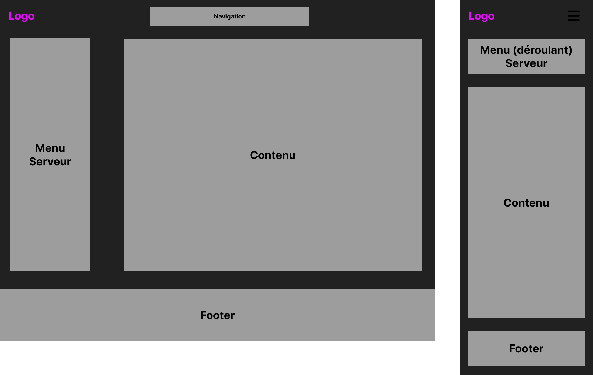

# **Cahier des charges**

### *Site Web fxGuard*

| Nom du projet :   | fxGuard                  |
| ----------------- | ------------------------ |
| Nom de l'auteur : | Edern FERLICOT           |
| Email :           | edern.ferlicot@gmail.com |

### Sommaire

1. **Présentation générale du projet**
   1. *Contexte*
   2. *Objectifs qualitatifs*
   3. *Cible(s) du site / de l'application*
2. **Aspects fonctionnels**
   1. *Description fonctionnelle*
   2. *User story*
   3. *Arborescence du site / navigation*
   4. *Restriction d'accès*
   5. *Layout ou wireframe des pages*
3. **Ressources**
4. **Ergonomie et graphisme**
   1. *Ergonomie, design & charte graphique*
   2. *Ergonomie*
5. **Contraintes techniques**
   1. *Architecture globale*
   2. *Sécurité*
   3. *Eco-responsabilité*
   4. *Accessibilité*
6. **SEO & Référencement**
7. **RGPD/Conditions d'utilisation**
8. **Planning & suivi du projet**
   1. *Planning*
   2. *Groupe de travail*

## **1. Présentation générale du projet**

### 1.1 **Contexte**

À la demande d'un client, j'ai dû trouver une solution web pour répondre à son besoin de modifier du contenu dans du code mais dans un espace no-code.

Le projet « fxGuard » a pour but de permettre la modération/administration et la modification du contenu présent en jeu d’un serveur FiveM, le tout dans un espace no-code.  
Les serveurs FiveM sont des serveurs de jeux basés sur GTA5 permettant l’ajout de fonctionnalités et de contenu, comme l’ajout de voitures, chat de proximité, etc.
FxGuard pourra par exemple modifier le catalogue de voitures mis en vente en donnant le prix, la vitesse, une photo, etc. du véhicule directement présent dans le jeu.

### 1.2 **Objectif(s) qualitatif(s)**

- Créer une interface lisible et facile à comprendre.
- Avoir un site responsive pour s'adapter à tout type de support

### 1.3 **Cible(s) du site / de l'application**

Le site Web a pour vocation à être utilisé par une tranche de public assez vaste :
- Des adolescents, jeunes adultes, adultes, avec un niveau débutant à confirmé en administration de serveur FiveM.
- Dans un premier temps, mon projet a pour objectif d’être utilisé dans les pays francophones.
- Le support le plus utilisé sera, à mon sens, dans un premier temps le desktop, et je vais développer une version mobile complète qui me servira d'atout pour rester compétitif face aux solutions déjà existantes.

## **2. Aspects fonctionnels**

### 2.1 **Description fonctionnelle**

1. Inscription
   - Un formulaire d'inscription demandant : pseudo, e-mail et mot de passe.

2. Connexion
   - Formulaire de connexion demandant l'identifiant et le mot de passe.

3. Déconnexion
   - Bouton de déconnexion

4. Profil utilisateur
   - Les utilisateurs pourront modifier les données renseignées lors de l'inscription.

5. Rubrique de promotion
   - Dans la page d'accueil, un paragraphe de promotion donnant les avantages à utiliser notre solution.

6. Contact
   - Un formulaire de contact sera mis à disposition pour tous les utilisateurs.

7. Filtrer la recherche
   - Lors de l'ajout de véhicule à un menu un bandeau de filtre avec une zone de recherche sera mis à disposition de l'utilisateur.

8. Ajouter des véhicules
   - Ajouter des véhicules au menu.

9.  Retirer des véehicules
   - Retirer des véhicules au menu.

10. Créer plusieurs menus
    - Possibilité de créer plusieurs sans écraser le précédent.

11. Supprimer un menu
    - Possibilité de supprimer un/des menus.

12. Modifier un menu
    - Possibilité de modifier un menu déja créé.

13. Liste des utilisateurs
    - En tant qu'administrateur j'ai accès à la liste de tous les utilisateurs inscrits.
  
14. Promouvoir un utilisateur
    - Je peux promouvoir un utilisateur au rang d'administrateur.

<!-- Si l’utilisateur souhaite s’inscrire, il devra renseigner un formulaire pour récupérer ses informations et avoir un espace dédié.

Une fois connecté, l'utilisateur aura accès à une liste de serveurs utilisant mon interface web et auxquels il a accès. Il devra alors choisir le serveur qu'il souhaite administrer. Une fois son choix fait, il accèdera à un menu proposant différentes fonctionnalités.

Grâce à ce menu, il pourra :
  - Accéder à un dashboard où seront affichées les informations principales du serveur.
  - Voir le nombre de joueurs connectés sur le serveur, avec leur "ID" en jeu, leur pseudo ainsi que le nom et prénom de leurs personnages.
  - Modifier les menus accessibles aux joueurs en jeu, comme le concessionnaire de voitures, où il pourra ajouter ou retirer des véhicules mis en vente. Toutes les données du véhicule seront affichées : type, nom, images, vitesse maximale et marque.
  - Accéder à la console du serveur.
  - Logs détaillés de toutes les interactions entre notre interface et votre serveur.
  - Gérer un système d'autorisation du panel afin d'accorder l'accès à d'autres personnes.

En tant qu’administrateur authentifié, nous avons accès à la liste de tous les serveurs utilisant notre solution, ainsi qu'à tous les comptes créés. Une fois un serveur sélectionné, nous avons accès au même menu que les utilisateurs authentifiés, à la différence que nous pouvons modifier certains éléments qui ne pouuront pas être re modifié par l'utilisateur authentifié, ainsi que des champs auxquels il n'a accès qu'en lecture.

Nous pouvons également ajouter ou retirer des droits d’accès aux panels des serveurs. -->

### 2.2 **User story**

#### Scénario 1 : Accueil pour utilisateur non authentifié

##### En tant qu'utilisateur non authentifié,

- Je veux voir une page de promotion de l'interface mettant en avant toutes les fonctionnalités disponibles.

- Je veux avoir la possibilité de m'inscrire ou de me connecter à l'interface via une section dédiée.

#### Scénario 2 : Inscription et authentification

##### En tant qu'utilisateur souhaitant s'inscrire,

- Je veux remplir un formulaire d'inscription afin de créer un compte et accéder à un espace dédié.

- Je veux pouvoir me connecter à mon compte pour accéder aux menus auxquels j'ai droit.

#### Scénario 3 : Sélection d'un serveur

##### En tant qu'utilisateur authentifié,

- Je veux voir une liste des menus personnalisés auxquels j'ai accès.

- Je veux avoir accès à des menus déjà faits.

- Je veux pourvoir modifier les menus déjà préfaits.

#### Scénario 4 : Gestion des menus accessibles aux joueurs

##### En tant qu'utilisateur authentifié,

- Je veux pouvoir modifier les menus disponibles en jeu.

- Par exemple, je veux pouvoir ajouter ou retirer des véhicules mis en vente dans le concessionnaire.

- Je veux voir toutes les données d'un véhicule, y compris : type, nom, images, vitesse maximale et marque.

#### Scénario 5 : Gestion des accès

##### En tant qu'utilisateur authentifié,

- Je veux pouvoir accorder l'accès à d'autres personnes pour modifier les menus avec moi.

#### Scénario 6 : Administration globale pour les administrateurs de la solution

##### En tant qu'administrateur de la solution,

- Je veux voir la liste de tous les comptes créés sur la plateforme.
- Je veux pouvoir créer des menus que les utilisateurs peuvent utiliser.
- Je veux pouvoir promouvoir un utilisateur en administrateur.

### 2.3 **Arborescence du site / navigation**

   *Front office* :

  

   *Back office* :

  

### 2.4 **Restriction d'accès**

| Pages        | Non-Authentifié | Authentifié | Administrateur |
| ------------ | --------------- | ----------- | -------------- |
| Home         | X               | X           | X              |
| Login        | X               | X           | X              |
| Register     | X               | X           | X              |
| Contact      | X               | X           | X              |
| Menu Liste   |                 | X           | X              |
| Menu Setting |                 | X           | X              |
| Profil       |                 | X           | X              |
| Back Home    |                 |             | X              |
| User List    |                 |             | X              |
| Creat Menu   |                 |             | X              |

### 2.5 **Layout ou wireframe des pages**

*Structure de la page d'Accueil :*                                           

*Structure de la page Server Setting :*

## **3. Ressources**

- API REST : https://gta.vercel.app/

## **4. Ergonomie et graphisme**

### 4.1 **Ergonomie, design & charte graphique**

Le site aura un thème très épuré et moderne, avec un fond gris foncé/noir et une couleur d’accentuation violette.  
Le logo sera très simpliste, reprenant le nom du site.  
La police utilisée sera une police neutre, la **Roboto**.

### 4.2 **Ergonomie**

Le site sera conçu pour être le plus intuitif possible, avec des noms de menus parlants. Les informations les plus importantes seront mises en avant.
Et un accent sur l'accessibilité sera fait.

## **5. Contraintes techniques**

### 5.1 **Architecture globale**

- **Frontend** :
  - Langages : HTML, CSS, JavaScript
  - API REST
  - Préprocesseur CSS : SASS
- **Backend** :
  - Architecture : Model View Controller
  - Langage : PHP, SQL
  - Base de données : MySQL

### 5.2 **Sécurité**

Pour garantir un niveau de sécurité optimal sur la plateforme, les lignes directrices suivantes seront appliquées tant au niveau du front-end que du back-end :

  
- **Validation et assainissement des données** : Des mécanismes de validation et d’assainissement des données seront utilisés pour toutes les données reçues des utilisateurs via les formulaires de contact, d’enregistrement et d’authentification. Ces données seront systématiquement nettoyées avant toute utilisation dans des requêtes à la base de données pour prévenir les attaques par injection SQL.
  
- **Protection contre les attaques XSS** : Des fonctions sécuritaires, telles que `htmlspecialchars()`, seront appliquées afin de convertir les caractères spéciaux en entités HTML et ainsi éviter les attaques de type Cross-Site Scripting (XSS) en désinfectant les entrées de l’utilisateur.

- **Validation stricte des entrées utilisateurs** : Toutes les entrées utilisateurs seront également soumises à une validation stricte (types, formats, etc.) pour s'assurer qu'elles respectent les critères attendus avant d’être traitées ou stockées.

- **Chiffrement des données sensibles** : Le chiffrement des données sensibles, notamment des mots de passe, sera réalisé à l’aide de fonctions de hachage sécurisées pour garantir leur sécurité en cas de fuite de données.

### 5.3 **Eco-resposabilité**

Afin de réduire l'empreinte écologique du projet fxGuard, plusieurs mesures seront mises en place :

- **Optimisation des performances** : Réduction des requêtes serveur et optimisation du code pour limiter la consommation énergétique.
- **Hébergement vert : Utilisation** d’un hébergement écoresponsable, fonctionnant avec des énergies renouvelables.
- **Compression des ressources** : Minimisation et compression des fichiers CSS, JavaScript et images pour réduire la bande passante utilisée.
  
Ces actions visent à améliorer l’impact environnemental du projet tout en garantissant une expérience utilisateur fluide et performante.

### **5.4 Accessibilité**
L'accessibilité est une priorité afin de garantir une expérience utilisateur optimale pour tous, y compris les personnes en situation de handicap. Pour cela, les actions suivantes seront mises en place :

- **Respect des normes WCAG** : Le site respectera les directives du W3C en matière d'accessibilité numérique (WCAG 2.1, niveau AA minimum).
- **Navigation au clavier** : Toutes les fonctionnalités seront accessibles sans souris, en utilisant uniquement le clavier (tabulation, raccourcis).
- **Contraste et lisibilité** : Les couleurs et typographies seront choisies pour assurer un bon contraste et une lecture aisée, même pour les personnes malvoyantes.
- **Textes alternatifs pour les images** : Toutes les images informatives incluront des descriptions textuelles (attributs alt) pour garantir leur compréhension par les utilisateurs malvoyants.
- **Adaptabilité aux différentes tailles d’écran** : L'interface sera entièrement responsive et optimisée pour différents types d’écrans, y compris mobiles et tablettes (Mobile First).

Ces actions assureront une meilleure accessibilité et permettront au plus grand nombre d’utiliser l’interface sans obstacles.

## **6. SEO & Référencement**

Dans le cadre de la création du site web d'administration de serveur FiveM, un point crucial concerne l'optimisation pour les moteurs de recherche (SEO/référencement).

Bien que le site soit principalement destiné à un usage privé et administratif, il est important de veiller à ce que certaines pages, comme les pages d'informations publiques, de documentation ou de support, soient optimisées pour le SEO.

Cela inclut l'utilisation de balises HTML appropriées, de titres et de descriptions bien structurés, ainsi qu'un contenu pertinent pour améliorer la visibilité sur les moteurs de recherche.

De plus, une architecture claire du site contribuera à la bonne indexation par les moteurs de recherche tout en assurant une navigation fluide pour les utilisateurs.

Enfin, l’optimisation des performances du site, notamment par la réduction des temps de chargement grâce à l'optimisation des images, du code CSS/JavaScript et la mise en cache, permettra d'améliorer l'expérience utilisateur tout en favorisant un meilleur référencement.

## **7. RGPD/Conditions d'utilisation**

fxGuard accorde une importance primordiale à la protection des données des utilisateurs et s’engage à respecter le Règlement général sur la protection des données (RGPD). De plus, toute inscription sur la plateforme implique l’acceptation des conditions d’utilisation, qui garantissent la sécurité des informations personnelles et interdisent la diffusion de contenus illégaux ou offensants. Les données collectées ne seront ni partagées avec des tiers sans le consentement explicite de l’utilisateur, ni exploitées à des fins marketing ou commerciales.

## **8. Planning & suivi du projet**

### 8.1 **Planning**

| Activité                                                                                            | Février S1 | Février S2 | Février S3 | Février S4 | Mars S1 | Mars S2 | Mars S3 | Mars S4 | Avril S1 | Avril S2 |
| --------------------------------------------------------------------------------------------------- | ---------- | ---------- | ---------- | ---------- | ------- | ------- | ------- | ------- | -------- | -------- |
| **Cahier des charges** -> *Chef de projet*                                                          | 🔵          | 🔵          | 🔵          | 🔵          | ⚪       |         |         |         |          |          |
| **Conception et mise en page** -> *Graphiste & UX/UI designer*                                      |            |            |            |            | 🟡       | ⚪       |         |         |          |          |
| **Conception et élaboration de bases de données**  -> *Développeur Base de données*                 |            |            |            |            |         | 🟢       | ⚪       |         |          |          |
| **Création d'un backend** -> *Développeur Backend & Responsable Qualité et Tests & Expert Sécurité* |            |            |            |            |         |         | 🟠       | ⚪       |          |          |
| **Création de frontend** -> *Développeur Frontend & Responsable Qualité & Tests & Référenceur SEO*  |            |            |            |            |         |         |         |         | 🔴        | ⚪        |

🔵 = Cahier des charges  
🟡 = Conception et mise en page  
🟢 = Bases de données  
🟠 = Backend  
🔴 = Frontend
⚪ = Validation avec le client

### 8.2 **Groupe de travail**

| **Rôle**                        | **Nom**           | **Responsabilités**                                                                                                                    |
| ------------------------------- | ----------------- | -------------------------------------------------------------------------------------------------------------------------------------- |
| **Chef de projet**              | Lucas Morel       | Supervise l'avancement du projet, assure la communication entre les membres et veille au respect des délais.                           |
| **UX/UI Designer**              | Emma Dubois       | Conçoit l'interface et l’expérience utilisateur, réalise les maquettes et prototypes.                                                  |
| **Graphiste**                   | Léa Martin        | Crée les éléments visuels (logos, icônes, illustrations) et assure la cohérence graphique du projet.                                   |
| **Développeur Frontend**        | Thomas Lefevre    | Développe l’interface utilisateur en respectant le design et les bonnes pratiques d’accessibilité.                                     |
| **Développeur Backend**         | Hugo Bernard      | Implémente les fonctionnalités du serveur, gère la base de données et l’authentification des utilisateurs.                             |
| **Développeur Base de données** | Sarah Fontaine    | Conçoit et optimise la structure des bases de données pour assurer la gestion efficace des serveurs et des utilisateurs.               |
| **Responsable Qualité & Tests** | Julien Garnier    | Met en place des tests (unitaires, intégration, UI) et s’assure du bon fonctionnement et de la sécurité de l’application.              |
| **Expert Sécurité**             | Camille Roche     | Garantit la sécurité des données et la conformité avec les réglementations (ex : RGPD).                                                |
| **Administrateur Système**      | Nathan Carpentier | Supervise l’hébergement et la mise en production de la plateforme, optimise les performances du serveur.                               |
| **Référenceur SEO**             | Antoine Dupont    | Optimise le site pour le référencement naturel (SEO), améliore la visibilité sur les moteurs de recherche et analyse les performances. |