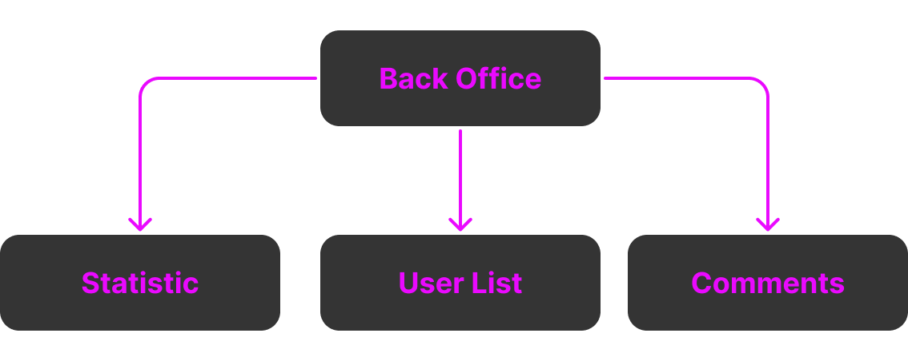

# **Cahier des charges**

### *Site Web fxGuard*

| Nom du projet :   | fxGuard                  |
| ----------------- | ------------------------ |
| Nom de l'auteur : | Edern FERLICOT           |
| Email :           | edern.ferlicot@gmail.com |

### Sommaire

1. **Présentation générale du projet**
   1. *Contexte*
   2. *Objectif(s) qualitatif(s) et/ou quantitatif(s) du site*
   3. *Cible(s) du site / de l'application*
2. **Aspects fonctionnels**
   1. *Description fonctionnelle*
   2. *User strory*
   3. *Arborescence du site / navigation*
   4. *Restriction d'accès*
   5. *Layout ou wireframe des pages*
3. **Ressources**
4. **Ergonomie et graphisme**
   1. *Ergonomie, design & charte graphique*
   2. *Ergonomie*
5. **Contraintes techniques**
   1. *Architecture globale*
   2. *Sécurité*
   3. *Eco-resposabilité*
   4. *Accessibilité*
6. **SEO & Référencement**
7. **RGPD/Conditions d'utilisation**
8. **Planning & suivi du projet**
   1. *Planning*
   2. *Groupe de trvail*

## **1. Présentation générale du projet**

### 1.1 **Contexte**

Le projet « fxGuard » a pour but de permettre la modération/administration et la modification du contenu présent en jeu d’un serveur FiveM, le tout dans un espace no-code.  
Les serveurs FiveM sont des serveurs de jeux basés sur GTA5 permettant l’ajout de fonctionnalité et de contenu, comme l’ajout de voiture, chat de proximité, etc.
FxGuard pourra par exemple modifier le catalogue de voitures mis en vente en donnant le prix, la vitesse, une photo, etc. du véhicule directement présent dans le jeu.

### 1.2 **Objectif(s) qualitatif(s) et/ou quantitatif(s) du site**

- Créer une interface graphique permettant aux administrateurs d’interagir avec le contenu présent en jeu.

### 1.3 **Cible(s) du site / de l'application**

Le site Web a pour vocation à être utilisé par une tranche de public assez vaste :
- Des adolescents, jeunes adultes, adultes, avec un niveau débutant à confirmé en administration de serveur FiveM.
- Dans un premier temps, mon projet a pour objectif d’être utilisé dans les pays francophones.
- Le support le plus utilisé sera, à mon sens, dans un premier temps le desktop, et je vais développer une version mobile complète qui me servira d'atout pour rester compétitif face aux solutions déjà existantes.

## **2. Aspects fonctionnels**

### 2.1 **Description fonctionnelle**

Lorsque l’utilisateur n’est pas authentifié, une page de promotion de l'interface avec toutes les fonctionnalités proposées sera affichée. Une partie proposera de s’inscrire ou de se connecter.

Si l’utilisateur souhaite s’inscrire, il devra renseigner un formulaire pour récupérer ses informations et avoir un espace dédié.

Une fois connecté, l'utilisateur aura accès à une liste de serveurs utilisant mon interface web et auxquels il a accès. Il devra alors choisir le serveur qu'il souhaite administrer. Une fois son choix fait, il accèdera à un menu proposant différentes fonctionnalités.

Grâce à ce menu, il pourra :
  - Accéder à un dashboard où seront affichées les informations principales du serveur.
  - Voir le nombre de joueurs connectés sur le serveur, avec leur "ID" en jeu, leur pseudo ainsi que le nom et prénom de leurs personnages.
  - Modifier les menus accessibles aux joueurs en jeu, comme le concessionnaire de voitures, où il pourra ajouter ou retirer des véhicules mis en vente. Toutes les données du véhicule seront affichées : type, nom, images, vitesse maximale et marque.
  - Accéder à la console du serveur.
  - Logs détaillés de toutes les interactions entre notre interface et votre serveur.
  - Gérer un système d'autorisation du panel afin d'accorder l'accès à d'autres personnes.

En tant qu’administrateur authentifié, nous avons accès à la liste de tous les serveurs utilisant notre solution, ainsi qu'à tous les comptes créés. Une fois un serveur sélectionné, nous avons accès au même menu que les utilisateurs authentifiés, à la différence que nous pouvons modifier certains éléments qui ne pouuront pas être re modifié par l'utilisateur authentifié, ainsi que des champs auxquels il n'a accès qu'en lecture.

Nous pouvons également ajouter ou retirer des droits d’accès aux panels des serveurs.

### 2.2 **User story**

#### Scénario 1 : Accueil pour utilisateur non authentifié

##### En tant qu'utilisateur non authentifié,

- Je veux voir une page de promotion de l'interface mettant en avant toutes les fonctionnalités disponibles.

- Je veux avoir la possibilité de m'inscrire ou de me connecter à l'interface via une section dédiée.

#### Scénario 2 : Inscription et authentification

##### En tant qu'utilisateur souhaitant s'inscrire,

- Je veux remplir un formulaire d'inscription afin de créer un compte et accéder à un espace dédié.

- Je veux pouvoir me connecter à mon compte pour accéder aux serveurs auxquels j'ai droit.

#### Scénario 3 : Sélection d'un serveur

##### En tant qu'utilisateur authentifié,

- Je veux voir une liste des serveurs auxquels j'ai accès.

- Je veux pouvoir choisir un serveur pour l'administrer.

- Une fois mon serveur sélectionné, je veux accéder à un menu d'administration proposant différentes fonctionnalités.

#### Scénario 4 : Accès au dashboard du serveur

##### En tant qu'utilisateur administrateur d'un serveur,

- Je veux voir un dashboard affichant les informations principales du serveur.

- Je veux voir le nombre de joueurs connectés avec leur ID en jeu, leur pseudo ainsi que le nom et prénom de leurs personnages.

#### Scénario 5 : Gestion des menus accessibles aux joueurs

##### En tant qu'utilisateur administrateur d'un serveur,

- Je veux pouvoir modifier les menus disponibles en jeu.

- Par exemple, je veux pouvoir ajouter ou retirer des véhicules mis en vente dans le concessionnaire.

- Je veux voir toutes les données d'un véhicule, y compris : type, nom, images, vitesse maximale et marque.

#### Scénario 6 : Accès à la console et aux logs

##### En tant qu'utilisateur administrateur d'un serveur,

- Je veux avoir accès à la console du serveur pour exécuter des commandes.

- Je veux pouvoir consulter les logs détaillés de toutes les interactions entre l'interface et le serveur.

#### Scénario 7 : Gestion des accès

##### En tant qu'utilisateur administrateur d'un serveur,

- Je veux pouvoir accorder l'accès à d'autres personnes pour administrer le serveur avec moi.

- Je veux pouvoir gérer les autorisations et les rôles des utilisateurs sur le panel.

#### Scénario 8 : Administration globale pour les administrateurs de la solution

##### En tant qu'administrateur de la solution,

- Je veux voir la liste de tous les serveurs utilisant notre interface.

- Je veux voir la liste de tous les comptes créés sur la plateforme.

- Je veux pouvoir sélectionner un serveur et accéder à son menu d'administration.

- Je veux avoir des droits supplémentaires me permettant de modifier certains éléments non modifiables par un utilisateur classique.

- Je veux pouvoir accéder à des champs en lecture seule pour les utilisateurs classiques.

- Je veux pouvoir ajouter ou retirer des droits d'accès aux panels des serveurs.

### 2.3 **Arborescence du site / navigation**

   *Front office* :

  

   *Back office* :

  

### 2.4 **Restriction d'accès**

| Pages          | Non-Authentifié | Authentifié | Administrateur |
| -------------- | --------------- | ----------- | -------------- |
| Home           | X               | X           | X              |
| Login          | X               | X           | X              |
| Register       | X               | X           | X              |
| Contact        | X               | X           | X              |
| Server Liste   |                 | X           | X              |
| Server Setting |                 | X           | X              |
| Profil         |                 | X           | X              |
| User List      |                 |             | X              |

### 2.5 **Layout ou wireframe des pages**

*Structure de la page d'Accueilp :*                                           

*Structure de la page Server Setting :*

## **3. Ressources**

- API : https://gta.vercel.app/

## **4. Ergonomie et graphisme**

### 4.1 **Ergonomie, design & charte graphique**

Le site aura un thème très épuré et moderne, avec un fond gris foncé/noir et une couleur d’accentuation violette.  
Le logo sera très simpliste, reprenant le nom du site.  
La police utilisée sera une police neutre, la **Roboto**.

### 4.2 **Ergonomie**

Le site sera conçu pour être le plus intuitif possible, avec des noms de menus parlants. Les informations les plus importantes seront mises en avant.
Et un accent sur l'accessibilité sera fait.

## **5. Contraintes techniques**

### 5.1 **Architecture globale**

- **Frontend** :
  - Langages : HTML, CSS, JavaScript
  - Bibliothèques et API
  - Outils : SASS
- **Backend** :
  - Architecture : Model View Controller
  - Langage : PHP, SQL
  - Base de données : MySQL

### 5.2 **Sécurité**

Nous mettons tout à disposition pour garantir la sécurité et l'intégrité de nos données. Ce site, développé en PHP, inclura des mécanismes de gestion robustes pour l’administration de serveurs FiveM via une interface complete. Il comprendra des fonctionnalités telles que la gestion des utilisateurs, la surveillance des performances du serveur, ainsi que la gestion des ressources et des configurations. Un accent particulier sera mis sur la sécurité, avec des protocoles de cryptage pour les données sensibles, des mécanismes de vérification des accès et un système de journalisation pour toute action effectuée. L’objectif est d’assurer un contrôle total et sécurisé de l'administration du serveur tout en garantissant une performance optimale et une interface utilisateur intuitive.

<!-- modifier plus technique -->

### 5.3 **Eco-resposabilité**

Afin de réduire l'empreinte écologique du projet fxGuard, plusieurs mesures seront mises en place :

- **Optimisation des performances** : Réduction des requêtes serveur et optimisation du code pour limiter la consommation énergétique.
- **Hébergement vert : Utilisation** d’un hébergement écoresponsable, fonctionnant avec des énergies renouvelables.
- **Compression des ressources** : Minimisation et compression des fichiers CSS, JavaScript et images pour réduire la bande passante utilisée.
- **Dark mode par défaut** : Réduction de la consommation d'énergie sur les écrans OLED et AMOLED.
- **Durabilité du développement** : Adoption de bonnes pratiques de développement pour assurer la maintenance et l'évolution du projet sans surconsommation de ressources.
  
Ces actions visent à améliorer l’impact environnemental du projet tout en garantissant une expérience utilisateur fluide et performante.

## **6. SEO & Référencement**

Dans le cadre de la création du site web d'administration de serveur FiveM, un point crucial concerne l'optimisation pour les moteurs de recherche (SEO/référencement).

Bien que le site soit principalement destiné à un usage privé et administratif, il est important de veiller à ce que certaines pages, comme les pages d'informations publiques, de documentation ou de support, soient optimisées pour le SEO.

Cela inclut l'utilisation de balises HTML appropriées, de titres et de descriptions bien structurés, ainsi qu'un contenu pertinent pour améliorer la visibilité sur les moteurs de recherche.

De plus, une architecture claire du site contribuera à la bonne indexation par les moteurs de recherche tout en assurant une navigation fluide pour les utilisateurs.

Enfin, l’optimisation des performances du site, notamment par la réduction des temps de chargement grâce à l'optimisation des images, du code CSS/JavaScript et la mise en cache, permettra d'améliorer l'expérience utilisateur tout en favorisant un meilleur référencement.

## **7. RGPD/Conditions d'utilisation**

fxGuard accorde une importance primordiale à la protection des données des utilisateurs et s’engage à respecter le Règlement général sur la protection des données (RGPD). De plus, toute inscription sur la plateforme implique l’acceptation des conditions d’utilisation, qui garantissent la sécurité des informations personnelles et interdisent la diffusion de contenus illégaux ou offensants. Les données collectées ne seront ni partagées avec des tiers sans le consentement explicite de l’utilisateur, ni exploitées à des fins marketing ou commerciales.

## **8. Planning & suivi du projet**

*En cours...*
